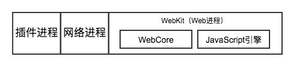
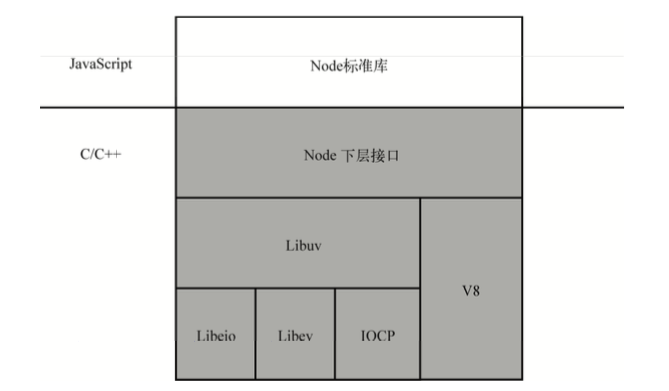

## 订阅发布模式
目录：  
[简介](#简介)  
[意义及其他模式中的订阅发布](#意义及其他模式中的订阅发布)  
[简单的订阅发布模式的实现](#简单的订阅发布模式的实现)  
[浏览器及node中订阅发布模式的实现](#浏览器及node中订阅发布模式的实现)  
[同步订阅与异步发布](#同步订阅与异步发布)  
[Vue中同步订阅与异步发布的原理](#vue中同步订阅与异步发布的原理)  
### 简介
> 发布—订阅模式又叫观察者模式,它定义对象间的一种一对多的依赖关系,当一个对象的状态发生改变时,所有依赖于它的对象都将得到通知。在 JavaScript 开发中,我们一般用事件模型来替代传统的发布—订阅模式。

**个人理解：**  
1. “事件”或状态发生变化，订阅该“事件”的对象得到通知或状态引发的操作得以执行
2. 订阅发布模式需要具备订阅功能如果必要，还应该具备取消订阅的功能
3. 消息的发布时机对于订阅的对象是未知的，如按钮不知道在什么时候会被点击
4. 发布消息时不论是订阅的状态还是订阅的事件都是以回调函数的方式进行传递
5. 由于JS单线程执行栈与环境交互严重依赖事件，天然支持订阅发布模式

### 意义及其他模式中的订阅发布
**意义：**  
在事件被触发、状态被改变时处理函数无需关注其事件被触发或状态被改变引发的一系列计算，只需要通知订阅该事件或状态的对象（执行处理函数）  

意义就是在于：  
1. 代码解耦，将事件触发与事件处理函数分离
2. 扩展性（可以增加更多的订阅）
3. 可维护性，只需要维护订阅函数即可
4. 天然地适合JS这种单线程，处理大量异步的脚本语言
******
**中介者模式：**  
中介者在与各个对象间通信就依赖于订阅发布
******
**代理模式：**  
如下面一个场景：屌丝A喜欢女神A，正好屌丝A和女神A的好友B比较熟，那么屌丝A决定让B来代理自己暗送秋波的行为，B会在女神A心情比较好的时候将秋波送给女神A，那么其实在这个过程中B就订阅了女神A的心情  

再比如在Vue中，整体思路是代理了State（如data，props选项）的get与set行为，如对于computed选项而言，在get State时（依赖收集，通过Watcher来完成）就是在订阅State的set行为，在State进行set操作时就会发布消息，computed才得以更新  
******

**状态模式：**  
对于状态模式而言，核心在于setState操作，然后在处理函数中执行相对应state触发的函数，这个过程其实可以看成订阅了各种状态  

比如在一个Vue项目中，有一个筛选栏，点击第一个按钮出现筛选面板1，点击第二个面板出现筛选面板2，点击第三个按钮出现筛选面板3，点击其他位置关闭所有面板，可以利用watch来实现发布功能

```JavaScript
data () {
  return {
    filterState: -1 // -1 close; 0 open panel1; 1 open panel2; 2 open panel3
  }
},
methods: {
  click (e) {
    if ('index' in e.target.dataset && this.filterState !== Number(e.target.dataset.index)) {
      this.filterState = Number(e.target.dataset.index)
    } else if (this.filterState !== -1) {
      this.filterState = -1
    }
  }
},
watch: {
  filterState: { // 订阅了状态，每种状态对应了其执行函数
    immediate: true,
    handler (v) {
      if (v === -1) {
        // close all panel
      } else if (v === 0) {
        // open panel1 close others panel
      } else if (v === 1) {
        // open panel2 close others panel
      } else if (v === 2) {
        // open panel3 close others panel
      }
    }
  }
}
```

### 简单的订阅发布模式的实现
1. 添加订阅的能力
2. 发布消息的能力
3. 取消订阅的能力

[demo](./base.html)

### 浏览器及node中订阅发布模式的实现
浏览器中js与网络、Dom等交互就依赖于事件（订阅发布）  
  

node中也有相应线程(Libuv)来与V8交互，通过订阅发布来“感知”事件
  

### 同步订阅与异步发布
试想以下场景，如果在某处触发了事件，但是在触发后又更改了执行函数中依赖的变量或者不希望执行函数阻塞了发布后代码，具体见下方示例：
```JavaScript
// 其实希望监听处理在下一个事件循环中调用
var a = 0
function doSomeThing () {
  observer.trigger('someEvent')
  a = 2
}
observer.addListener('someEvent', () => {
  console.log(a)
})
doSomeThing()
// 0

// 监听函数可能阻塞代码
function doSomeElseThing () {
  observer.trigger('someEvent')
  doSomeImportantThing()
}
observer.addListener('someEvent', () => {
  while (true) {}
})
doSomeElseThing()
// 将阻塞重要的代码。。。
```
其实在Vue中这种场景非常常见，一个函数中更改了多个被代理的State，如果每个set行为将同步更新其被依赖的computed，watch，vdom显然会使得vue性能大幅降低，会进行大量的不必要的运算  
[demo](./async.html)

### Vue中同步订阅与异步发布的原理
```javaScript
data () {
  return {
    value: 1,
    value2: 2
  }
},
computed: {
  myValue () {
    console.log(this.value2)
    return this.value * 2
  }
},
watch: {
  myValue () {
    console.log(123)
  }
},
methods: {
  click () {
    this.value2++
  }
}
```
自己体会  
提示：收集依赖就是一个订阅的过程，在一个事件循环过程中，set并不会直接触发订阅，而是执行定义的一个notify方法，notify更新一个update队列，在事件循环结束再去执行整个update队列
